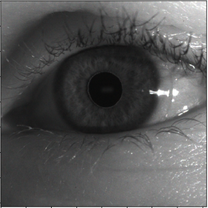
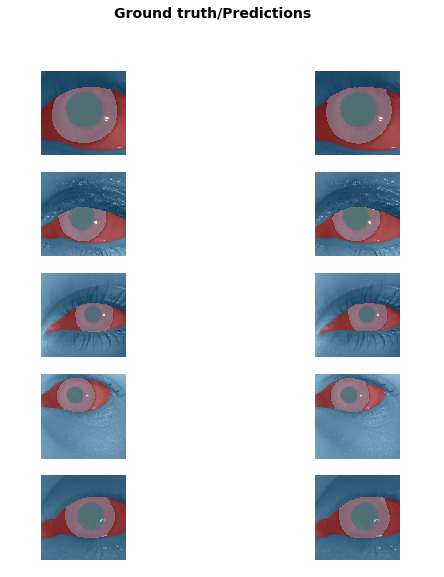

# Image Segmentation using FastAI - Eye Segmentation
Eye segmentation using FastAI

Training data: 500 images/masks over 20 epochs.

Accuracy: Achieved 95.7% accuracy.

Accuracy calculation was done by comparing the number of pixels between the ground truth and the predicted mask (ignoring the background).

Image example:

Mask example:

Output:

